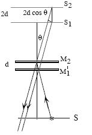

## Theory

<iframe width="560" height="315" src="https://www.youtube.com/embed/lzBKlY4f1XA" frameborder="0" allow="autoplay; encrypted-media" allowfullscreen></iframe>

Interferometers are used to precisely measure the wavelength of optical beams through the creation of interference patterns . The Michelson interferometer is a historically important device which provides simple interferometric configuration, useful for introducing basic principles.

### Interference theory

Light is a transverse wave. When two waves of same wavelength and amplitude travel through same medium, their amplitudes combine. A wave of greater or lesser amplitude than the original will be the result. The addition of amplitudes due to superposition of two waves is called interference. If the crest of one wave meets with the trough of the other, the resultant intensity will be zero and the waves are said to interfere destructively. Alternatively, if the crest of one wave meets with the crest of the other, the resultant  will be maximum intensity and the waves are said to interfere constructively. 
 

Suppose two coherent (i.e. their initial phase relationship remains constant) waves start from the same point and travel different paths before coming back together and interfering with each other. Suppose also that the re-combined waves illuminate a screen where the position on the screen depends on the difference in the lengths of the paths traveled by the two waves. Then the resulting alternating bright and dark bands on the screen are called interference fringes.

  

 

In constructive interference, a bright fringe (band) is obtained on the screen. For constructive interference to occur, the path difference between two beams must be an integral multiple $m\lambda$ of the wavelength $\lambda$, where $m$ is the order, with m =0,1,2...

If the path difference between two waves is $(m+\frac{1}{2})\lambda$, the interference between them is destructive, and a dark fringe appears on the screen.

### Michelson Interferometer
 

The Michelson interferometer is the best example of what is called an amplitude-splitting interferometer. It was invented in1893 by Albert Michelson, to measure a standard meter in units of the wavelength of the red line of the cadmium spectrum. With an optical interferometer, one can measure distances directly in terms of wavelength of light used, by counting the interference fringes that move when one or the other of two mirrors are moved. In the Michelson interferometer, coherent beams are obtained by splitting a beam of light that originates from a single source with a partially reflecting mirror called a beam splitter. The resulting reflected and transmitted waves are then re-directed by ordinary mirrors to a screen where they superimpose to create fringes. This is known as interference by division of amplitude. This interferometer, used in 1817 in the famous Michelson- Morley experiment, demonstrated the non-existence of an electromagnetic-wave-carrying ether, thus paving the way for the Special theory of Relativity.

  

    
    
Figure 1:A simplified diagram of a Michelson interferometer

  

  
  

    
    
Figure 2: schematic representation of circular fringes

  

Since the reflecting surface of the beam splitter BS is the surface on the lower right, the light ray starting from the source S and undergoing reflection at the mirror M2&nbsp;passes through the beam splitter three times, while the ray reflected at M1&nbsp;travels through BS only once. The optical path length through the glass plate depends on its index of refraction, which causes an optical path difference between the two beams. To compensate for this, a glass plate CP of the same thickness and index of refraction as that of BS is introduced between M1&nbsp;and BS.&nbsp;The recombined beams interfere and produce fringes at the screen E. The relative phase of the two beams determines whether the interference will be constructive or destructive. By adjusting the inclination of M1&nbsp;and M2, one can produce circular fringes, straight-line fringes, or curved fringes. This lab uses circular fringes, shown in Fig. 2.

From the screen, an observer sees M2&nbsp;directly and the virtual image M1'&nbsp;of the mirror M1,&nbsp;formed by reflection in the beam splitter, as shown in Fig. 3. This means that one of the interfering beams comes from M2&nbsp;and the other beam appears to come from the virtual image M1'. If the two arms of the interferometer are equal in length, M1'&nbsp;coincides with M2. If they do not coincide, let the distance between them be <i>d</i>, and consider a light ray from a point S. It will be reflected by both M1'&nbsp;and M2, and the observer will see two virtual images, S1&nbsp;due to reflection at M1',&nbsp;and S2&nbsp;due to reflection at M2. These virtual images will be separated by a distance 2<i>d</i>. If $\theta$ is the angle with which the observer looks into the system, the path difference between the two beams is $2d\cos \theta$. When the light that comes from M1 undergoes reflection at BS, a phase change of <i>Ï€</i> occurs, which corresponds to a path difference of $\lambda /2$.

Therefore, the total path difference between the two beams is,

$$\Delta =2d \cos \theta+\frac{\lambda}{2}$$

  
Figure 3
 

The condition for constructive interference is then,

$$\Delta =2d \cos \theta+\frac{\lambda}{2}=m\lambda ...........(1)$$

$m=0,1,2,....$

For a given mirror separation d, a given wavelength $\lambda$, and order m, the angle of inclination $\theta$¸  is a constant, and the fringes are circular. They are called fringes of equal inclination, or Haidinger fringes. If $M_{1}'$ coincides with $M_{2}$, d = 0, and the path difference between the interfering beams will be $\lambda/2$. This corresponds to destructive interference, so the center of the field will be dark.

If one of the mirrors is moved through a distance $\lambda/4$, the path difference changes by $\lambda/2$ and a maximum is obtained. If the mirror is moved through another $\lambda/4$, a minimum is obtained; moving it by another $\lambda/4$, again a maximum is obtained and so on. Because d is multiplied by $\cos \theta$, as d increases, new rings appear in the center faster than the rings already present at the periphery disappear, and the field becomes more crowded with thinner rings toward the outside. If d decreases, the rings contract, become wider and more sparsely distributed, and disappear at the center.

For destructive interference, the total path difference must be an integer number of wavelengths plus a half wavelength, 

$$\Delta_{destr} =2d \cos \theta+\frac{\lambda}{2}=(m+\frac{1}{2})\lambda$$

m=0,1,2,3, ...

If the images $S_{1}$ and $S_{2}$ from the two mirrors are exactly the same distance away, d=0 and there is no dependance on $\lambda$. This means that only one fringe is visible, the zero order destructive interfrence fringe, where
$$\Delta_{destr} =\frac{\lambda}{2}=(m+\frac{1}{2})\lambda$$

m=0.

and the observer sees a single, large, central dark spot with no surrounding rings.

### Measurement of wavelength

Using the Michelson interferometer, the wavelength of light from a monochromatic source can be determined. If $M_{1}$ is moved forward or backward, circular fringes appear or disappear at the centre. The mirror is moved through a known distance d and the number N of fringes appearing or disappearing at the centre is counted. For one fringe to appear or disappear, the mirror must be moved through a distance of $\lambda/2$. Knowing this, we can write,

$$d =\frac{N\lambda}{2}$$

so that the wavelength is,    

$$\lambda =\frac{2d}{N}................(2)$$

### Applications
 
1. The Michelson - Morley experiment is the best known application of Michelson Interferometer.
2. They are used for the detection of gravitational waves.
3. Michelson Interferometers are widely used in astronomical Interferometry. 

