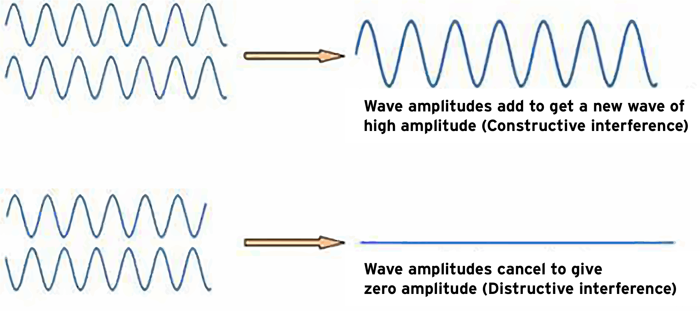
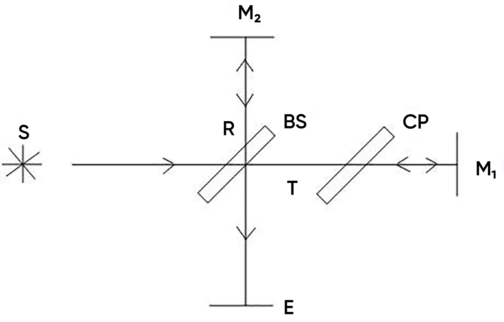

## Theory

<iframe width="560" height="315" src="https://www.youtube.com/embed/lzBKlY4f1XA" frameborder="0" allow="autoplay; encrypted-media" allowfullscreen></iframe>

Interferometers are used to precisely measure the wavelength of optical beams through the creation of interference patterns . The Michelson interferometer is a historically important device which provides simple interferometric configuration, useful for introducing basic principles.

### Interference theory

Light is a transverse wave. When two waves of same wavelength and amplitude travel through same medium, their amplitudes combine. A wave of greater or lesser amplitude than the original will be the result. The addition of amplitudes due to superposition of two waves is called interference. If the crest of one wave meets with the trough of the other, the resultant intensity will be zero and the waves are said to interfere destructively. Alternatively, if the crest of one wave meets with the crest of the other, the resultant  will be maximum intensity and the waves are said to interfere constructively. 
 

Suppose two coherent (i.e. their initial phase relationship remains constant) waves start from the same point and travel different paths before coming back together and interfering with each other. Suppose also that the re-combined waves illuminate a screen where the position on the screen depends on the difference in the lengths of the paths traveled by the two waves. Then the resulting alternating bright and dark bands on the screen are called interference fringes.

  

 

In constructive interference, a bright fringe (band) is obtained on the screen. For constructive interference to occur, the path difference between two beams must be an integral multiple $m\lambda$ of the wavelength $\lambda$, where $m$ is the order, with m =0,1,2...

If the path difference between two waves is $(m+\frac{1}{2})\lambda$, the interference between them is destructive, and a dark fringe appears on the screen.

### Michelson Interferometer
 

The Michelson interferometer is the best example of what is called an amplitude-splitting interferometer. It was invented in1893 by Albert Michelson, to measure a standard meter in units of the wavelength of the red line of the cadmium spectrum. With an optical interferometer, one can measure distances directly in terms of wavelength of light used, by counting the interference fringes that move when one or the other of two mirrors are moved. In the Michelson interferometer, coherent beams are obtained by splitting a beam of light that originates from a single source with a partially reflecting mirror called a beam splitter. The resulting reflected and transmitted waves are then re-directed by ordinary mirrors to a screen where they superimpose to create fringes. This is known as interference by division of amplitude. This interferometer, used in 1817 in the famous Michelson- Morley experiment, demonstrated the non-existence of an electromagnetic-wave-carrying ether, thus paving the way for the Special theory of Relativity.

  

    
    
Figure 1:A simplified diagram of a Michelson interferometer

  

  
  

    
    
Figure 2: schematic representation of circular fringes

  

